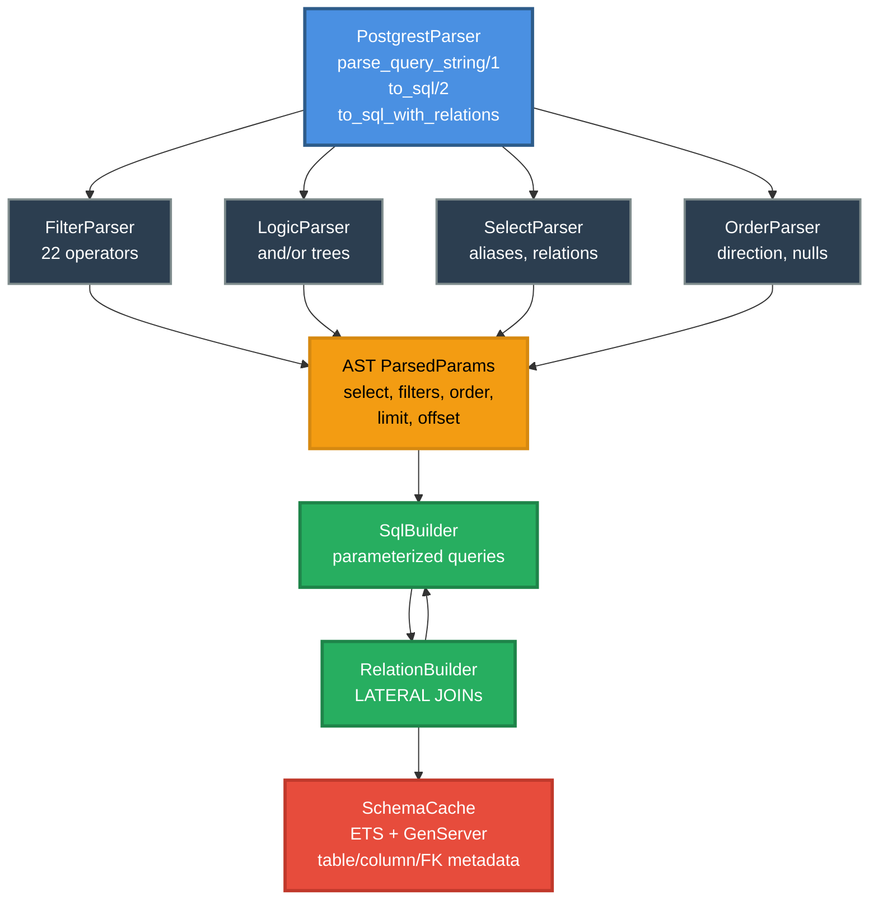

# PostgrestParser

[](https://hex.pm/packages/postgrest_parser)
[](https://hexdocs.pm/postgrest_parser)
[](LICENSE)

PostgREST URL-to-SQL parser for Elixir. Parse PostgREST-style query strings into safe, parameterized SQL queries.

## Overview

PostgrestParser converts HTTP URL query parameters into PostgreSQL queries, enabling modern REST API patterns where query string parameters control filtering, selection, ordering, and pagination. This is the core technology behind PostgREST and Supabase APIs.

```elixir
PostgrestParser.query_string_to_sql("users", "select=id,name&status=eq.active&order=created_at.desc&limit=10")
# => {:ok, %{
#      query: ~s(SELECT "id", "name" FROM "users" WHERE "status" = $1 ORDER BY "created_at" DESC LIMIT $2),
#      params: ["active", 10]
#    }}
```

## Features

| Category | Supported |
|----------|-----------|
| **Filter Operators** | eq, neq, gt, gte, lt, lte, like, ilike, match, imatch, in, is, fts, plfts, phfts, wfts, cs, cd, ov, sl, sr, nxl, nxr, adj |
| **Negation** | `not.eq`, `not.in`, `not.like`, etc. |
| **Logic Trees** | `and(filter1,filter2)`, `or(filter1,filter2)`, nested logic |
| **Select** | Column selection, aliases (`alias:column`), wildcards (`*`), spreads (`...relation`) |
| **Relations** | Resource embedding with LATERAL JOINs (M2O, O2M, O2O, M2M) |
| **Order** | Direction (`asc`/`desc`), nulls handling (`nullsfirst`/`nullslast`) |
| **Pagination** | `limit` and `offset` |
| **JSON Paths** | Arrow operators (`data->key`, `data->>key`), array indexing |
| **Full-Text Search** | `fts`, `plfts` (plain), `phfts` (phrase), `wfts` (websearch) |
| **Range/Array Ops** | Contains (`cs`), contained by (`cd`), overlap (`ov`), adjacent (`adj`) |

## Installation

Add `postgrest_parser` to your dependencies in `mix.exs`:

```elixir
def deps do
  [
    {:postgrest_parser, "~> 0.1.0"}
  ]
end
```

## Usage

### Basic Query Parsing

```elixir
# Parse and generate SQL in one step
{:ok, result} = PostgrestParser.query_string_to_sql("users", "select=id,name&status=eq.active")
# => %{query: ~s(SELECT "id", "name" FROM "users" WHERE "status" = $1), params: ["active"]}

# Or parse first, then generate SQL
{:ok, params} = PostgrestParser.parse_query_string("select=id,name&id=eq.1&order=id.desc")
{:ok, result} = PostgrestParser.to_sql("users", params)
```

### Filter Examples

```elixir
# Equality
"status=eq.active"

# Comparison operators
"price=gt.100"
"age=gte.18"

# Pattern matching
"name=like.*Smith"
"email=ilike.*@gmail.com"

# Set membership
"id=in.(1,2,3)"
"status=in.(pending,processing)"

# Null checks
"deleted_at=is.null"
"verified=is.true"

# Negation
"status=not.eq.deleted"
"id=not.in.(1,2,3)"

# JSON fields
"metadata->>tier=eq.gold"
"settings->notifications->>email=eq.true"
```

### Logic Trees

```elixir
# AND conditions
"and=(status.eq.active,verified.is.true)"

# OR conditions
"or=(status.eq.pending,status.eq.processing)"

# Nested logic
"and=(category.eq.Electronics,or(price.lt.100,stock.gt.50))"

# Negated logic
"not.and=(status.eq.deleted,archived.is.true)"
```

### Ordering and Pagination

```elixir
# Single column ordering
"order=created_at.desc"

# Multiple columns
"order=category.asc,price.desc"

# Nulls handling
"order=updated_at.desc.nullslast"

# Pagination
"limit=10&offset=20"
```

### Building Filter Clauses (for CDC)

Useful for Change Data Capture subscriptions where you only need the WHERE clause:

```elixir
{:ok, result} = PostgrestParser.build_filter_clause(%{
  "user_id" => "eq.123",
  "status" => "in.(active,pending)"
})
# => %{clause: ~s("user_id" = $1 AND "status" = ANY($2)), params: [123, ["active", "pending"]]}
```

### Resource Embedding (Relations)

For PostgREST-style resource embedding with LATERAL JOINs:

```elixir
# Start the application (starts SchemaCache GenServer)
Application.ensure_all_started(:postgrest_parser)

# Connect to database and refresh schema cache
{:ok, conn} = Postgrex.start_link(hostname: "localhost", database: "mydb", username: "postgres", password: "postgres")
:ok = PostgrestParser.SchemaCache.refresh("tenant_1", conn)

# Generate queries with embedded relations
{:ok, result} = PostgrestParser.query_string_to_sql_with_relations(
  "tenant_1",
  "public",
  "orders",
  "select=id,status,customers(id,name,email)"
)
# Generates LATERAL JOIN for the customers relation
```

Supported relationship cardinalities:
- **Many-to-One (M2O)**: Orders → Customer (returns single object)
- **One-to-Many (O2M)**: Customer → Orders (returns array)
- **One-to-One (O2O)**: Customer → Profile (returns single object)
- **Many-to-Many (M2M)**: Posts ↔ Tags through junction table (returns array)

## Architecture



## Development

### Prerequisites

- Elixir 1.14+
- PostgreSQL 15+ (for integration tests)
- Docker (optional, for running test database)

### Running Tests

Unit tests only:

```bash
mix test --exclude integration
```

With integration tests (requires database):

```bash
# Start the test database
docker-compose up -d

# Wait for it to be ready
docker-compose exec postgres pg_isready -U postgres -d postgrest_parser_test

# Run all tests
mix test
```

### Generating Documentation

```bash
mix docs
open doc/index.html
```

## Security

All SQL generation uses parameterized queries with `$1`, `$2`, etc. placeholders to prevent SQL injection. Identifiers are properly quoted and escaped.

```elixir
# Safe - uses parameterized query
PostgrestParser.query_string_to_sql("users", "name=eq.'; DROP TABLE users;--")
# => %{query: ~s(SELECT * FROM "users" WHERE "name" = $1), params: ["'; DROP TABLE users;--"]}
```

## License

MIT - See [LICENSE](LICENSE) for details.

## Contributing

Contributions are welcome! Please see [CONTRIBUTING.md](CONTRIBUTING.md) for guidelines.
